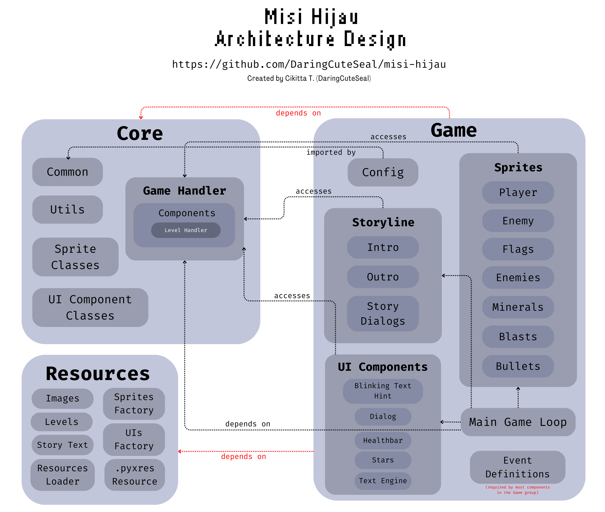
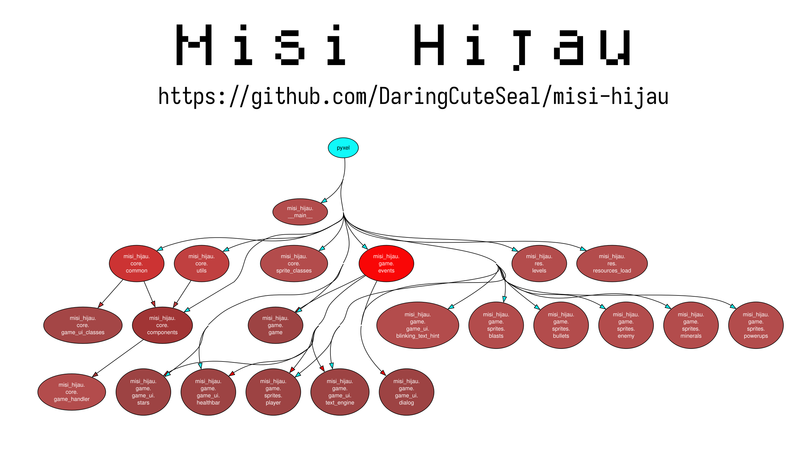

# Graph




# Tour
Take a look at [the main file](misi_hijau/__main__.py). It has an `App` class which wraps the Pyxel app, so you can just call App() to start the game.

At the `__init__` method, you can see the initialization of Pyxel, the resources being loaded, and a `Game` instance being created. Then, Pyxel will actually run with `update` method as the update loop, and `draw` method as the draw loop.

```python
        # Pyxel stuff
        pyxel.init(WINDOW_WIDTH, WINDOW_HEIGHT, capture_scale=8, title="Misi Hijau", fps=30, quit_key=pyxel.KEY_NONE)
        startup_load_resources()

        self.game = Game()

        # Run Pyxel!
        print("Selamat datang di Misi Hijau!")
        pyxel.run(self.update, self.draw)
 
```

The


im too lazy to finish ples


# Males
Males lanjut. 😪💀 Aaanyways I'm finally free from this curse.